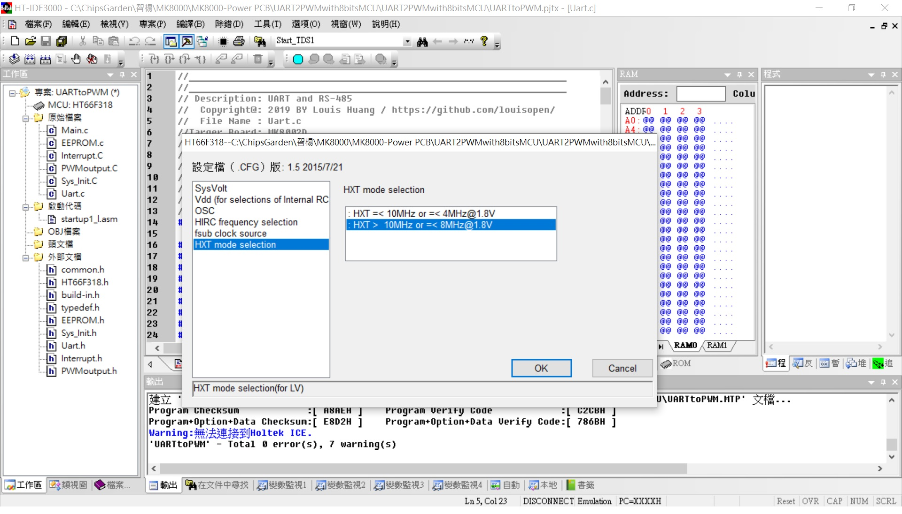
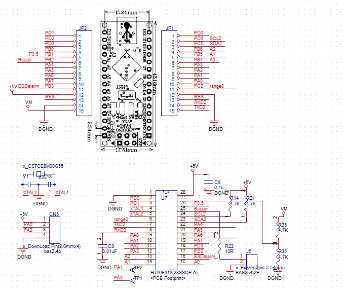

## ※HT66F318 For Arduino NANO
* HOLTEK HT66F318 28SSOP Pin assignment for Arduino Nano applications. 
利用HT66F318 28SSOP 取代Ardunio Nano 可以在量化上的應用實驗!!!(僅提供Pin取代性原理圖) 
在不想使用Arduino或只是極簡單應用或大量使用, 必須有成本考慮時, 即可以自己製造簡單的應用裝置. 
### For example:
* Project Option: 
HXT (External 8MHz X'tal); 可選項有:HXT(400K~16Mhz),HIRC8M,HIRC12M,HIRC16M 
LICR (Low speed internal RC for TB0/TB1); 可選項有:LXT(32.768Khz),LIRC(32Khz) 

* UART port Baudrate:9600,n,8,1 

* Time base timer (TB0,1) enable LIRC interrupt for 16ms, 0.514sec 

* Timer Module (TM0) enable HXT interrupt for 200us 

* ADC設置直接透過AN0~AN7讀取外部輸入,或AVDD,AVDD1/2,AVDD1/4讀取內部輸入.

* PWM輸出
PWM(HT66F317)設置直接透過TP0, TP1輸出, TM0/TM1(16bit), 最大設置TM0/TM1(16bit)
PWM(HT66F318)設置直接透過TP0, TP1, TP2輸出, TM0(hi-16bit), 最大設置TM1(10bit), TM2(hi-16bit)

* 輸入訊號捕捉 [量測_pb3/TP2(TM2) PWM或量測_pb1 test outpt]
Capture(HT66F317)設置TP1當輸入條件16bit+16bit counting
Capture(HT66F318)設置TP1當輸入條件10bit+16bit counting

* HT-IDE3000 HT66F317/HT66F318 28ssop with HT-IDE3000 & e-Link & e-WriterPro 
文件[HT66F318 Document](https://www.holtek.com.tw/search?key=ht66F318) 
模擬&除錯Development & Debug[IDE3000 & ICE](https://www.holtek.com.tw/web/guest/ice) 
燒入器Progrmming & writer[HOPE3000 & e-WriterPro](https://www.holtek.com.tw/web/guest/programmer) 

### Relevant information
* HT-IDE3000 V8.02

* HOLTEK C Compiler V3/Assembly

* HT66F318 Config, used 8Mhz X'tal external, VDD/VDDA binding

* HT66F318 28ssop Schematic Diagram 

### How to test or used
* 參考原理圖(part)

### Other applications
* 
