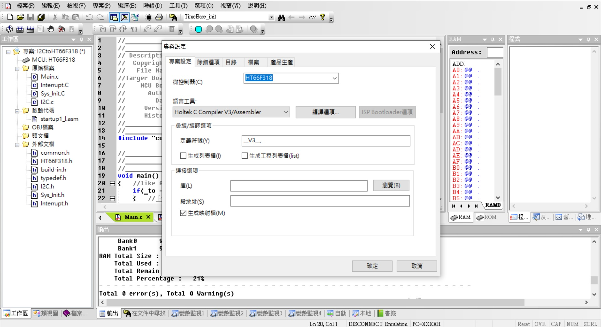
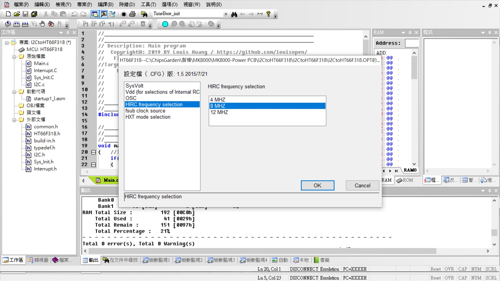

## HT66F318_Arduino
HOLTEK HT66F318 28SSOP Pin assignment for Arduino Nano applications.利用HT66F318 28SSOP 取代Ardunio Nano 可以在量化上的應用實驗!!!(僅提供Pin取代性原理圖) 
在不想使用Arduino或只是極簡單應用或大量使用有成本考慮時, 即可以自己製造簡單的應用裝置. 

Project Option: HXT; 可選項還有(小心使用)HXT,HIRC8M,HIRC12M,HIRC16M,LXT,LIRC

HT66F318 28ssop with HT-IDE3000 V8.02 & e-Link & e-WriterPro 
[HT66F318 Document](https://www.holtek.com.tw/search?key=ht66F318) 
[IDE3000 & ICE & Writer](https://www.holtek.com.tw/ice) 

### Relevant information
* HT-IDE3000 V8.02

* HOLTEK C Compiler V3/Assembly

* HT66F318 Config, used 8Mhz X'tal external, VDD/VDDA binding

* HT66F318 28ssop Schematic Diagram 

### How to test or used
* 參考原理圖(part)

### Other applications
* 
